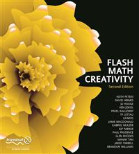

# Apress Source Code

This repository accompanies [*Flash Math Creativity*](http://www.apress.com/9781590594292) by Kip Parker, Brandon Williams, Jared Tarbell, Mary Ann Tan, Fay Rhodes, Keith Peters, Connor McDonald, Ty Lettau, Paul Prudence, JD Hooge, David Hirmes, Ken Jokol, Pavel Kaluzhny, and Gabriel Mulzer (Apress, 2004).

Download the files as a zip using the green button, or clone the repository to your machine using Git.

## Releases

Release v1.0 corresponds to the code in the published book, without corrections or updates.

## Contributions

See the file Contributing.md for more information on how you can contribute to this repository.
